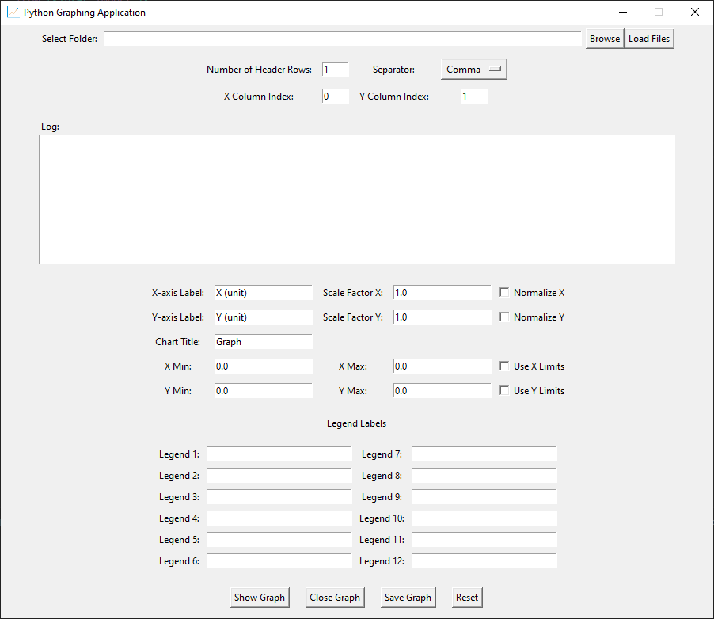
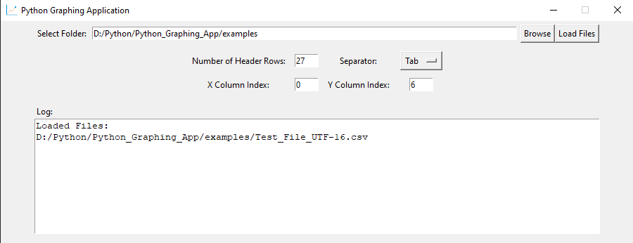
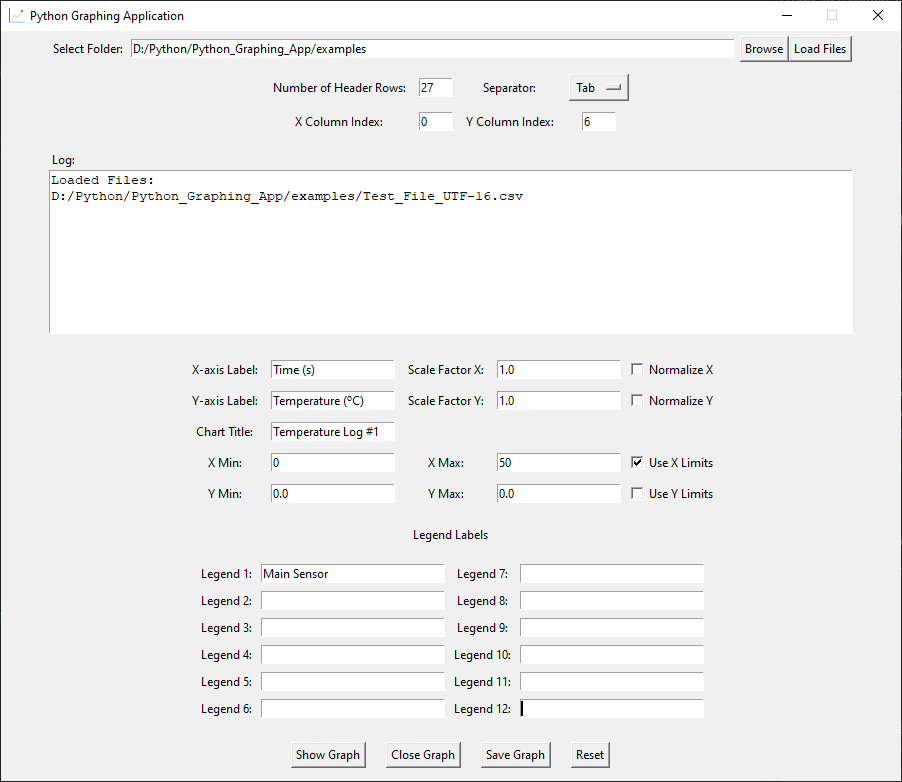
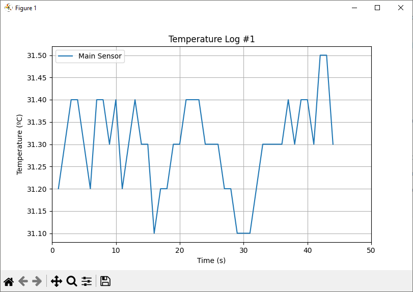
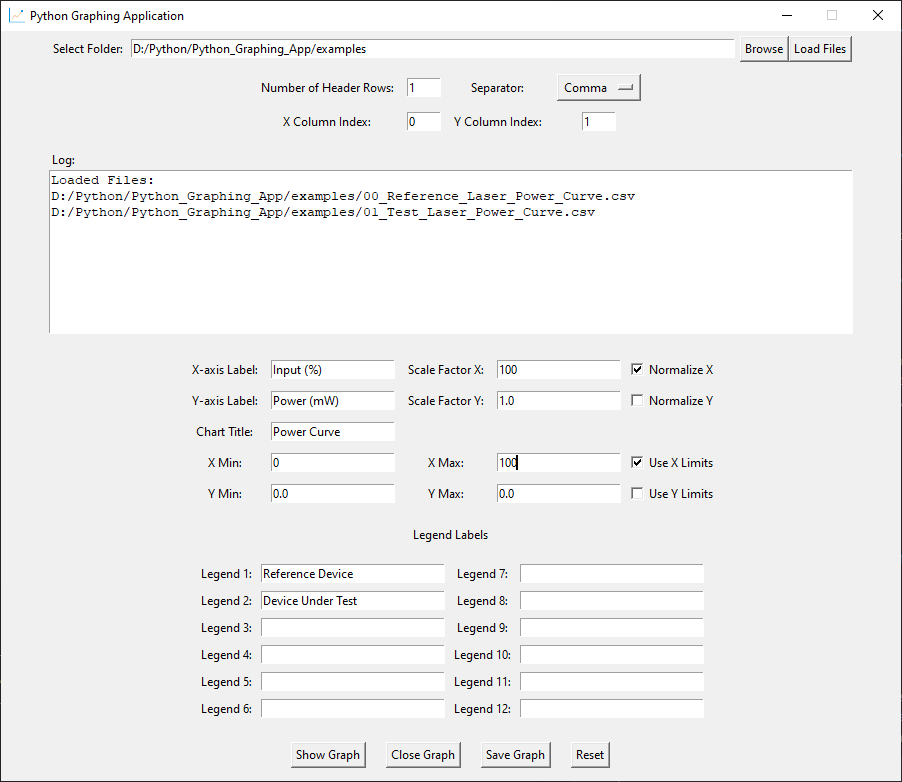
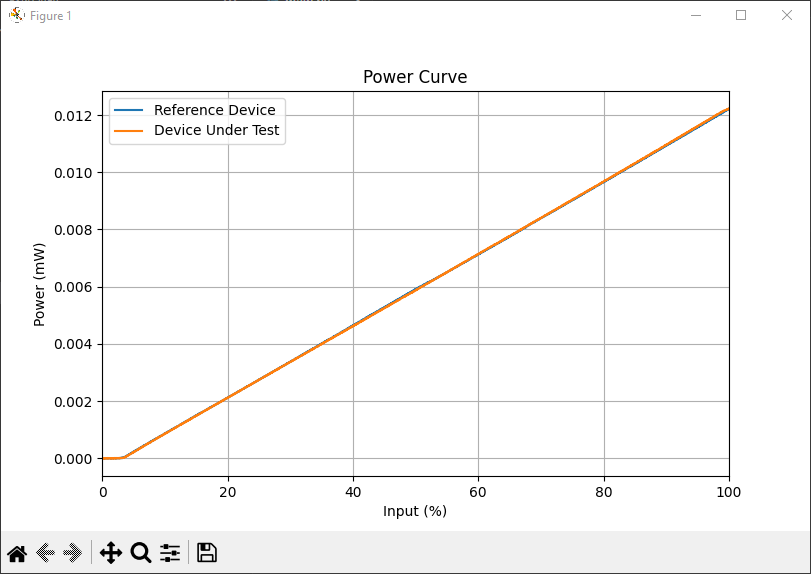

# Python Graphing Application

This is a Python-based application for graphing data from CSV files. The application uses Tkinter for the graphical user interface and Matplotlib for plotting graphs.

## Features

- Load CSV files (up to 12) and plot graphs based on selected columns.
- Preview loaded CSV data and inspect detected columns before plotting.
- Auto-detect the separator used in a CSV file.
- Select X and Y columns from dropdowns built from the file headers.
- Customize graph titles, axis labels, and legend labels.
- Normalize and scale data on the X and Y axes.
- Set axis display limits for both X and Y axes.
- Customize line style, marker style, line width, and grid visibility.
- Save and load named presets of all graph settings (`graph_presets.json`).
- Save graphs as PNG or SVG files (only while a graph window is open).
- Reset the application to its initial state.

## Requirements

- Python 3.x
- Tkinter (usually included with Python)
- Matplotlib >= 3.10.0
- Pandas >= 2.2.3
- Chardet (for detecting file encoding) >= 5.2.0

## Installation

1. Clone the repository or download the source code.
2. Install the required Python packages using pip:

    ```sh
    pip install matplotlib pandas chardet
    ```

    Alternatively, the project provides a `pyproject.toml` for [uv](https://docs.astral.sh/uv/):

    ```sh
    uv sync
    ```

## Usage

1. Navigate to the directory containing the source code.
2. Run the application:

    ```sh
    python app/main.py
    ```

3. You should see this GUI
   

4. Select the folder containing the CSV files using the **Browse** button and select the files you want using the **Load Files** button
   

5. Set the **number of header rows** (metadata rows skipped before the header, default `0`) and the **separator type**, or let the app help you:
   - **Preview Data** opens a window showing the columns and first rows of the first loaded file, so you can check your settings.
   - **Auto-Detect Separator** tests the supported separators (comma, semicolon, colon, space, tab) on the first loaded file and selects the one that yields the most columns.
   - After loading files, the **X Column** and **Y Column** dropdowns are populated with the detected column names; `Auto (0)` / `Auto (1)` keep the default column indices. Index starts at 0.

6. Set the desired axis options and legend label(s) if required (optional).
   **Normalize** divides the axis data by its max value (new values range will be from 0 to 1)
   **Scale Factor** multiplies the axis data by a constant, useful to show percentage (scale factor = 100) after normalizing, or transforming units (e.g. changing Watts to Milliwatts using scale factor = 1000)
   

7. Optionally customize the curve appearance: **Line Style** (Solid, Dashed, Dotted, Dash-dot), **Marker Style** (None, Circle, Square, Triangle, …), **Line Width**, and the **Enable Grid** checkbox.

8. Click the **Show Graph** button, based on the settings above, you should see the following graph
   
   Click on **Save Graph** to save the active graph as either a PNG or SVG image. If no graph is currently displayed (e.g. the graph window was closed), a warning is shown instead of saving a blank image.

9. To reuse a set of settings later, click **Save Preset** and give it a name; click **Load Preset** to re-apply a saved preset. Presets are stored in `graph_presets.json` next to where the app is run.

10. To select a new data source, click on **Close Graph** and **Reset**

11. To show more than 1 curve, repeat step 4 and select multiple files. With the parameters set as shown below:
    
    You should see this graph:
    

## File Structure

- [main.py](app/main.py): Entry point of the application.
- [gui.py](app/gui.py): Contains the [GraphingApp](app/gui.py) class which defines the GUI and its functionality.
- [file_manager.py](app/file_manager.py): Manages file selection, loading, data preview, and separator auto-detection.
- [plot_manager.py](app/plot_manager.py): Manages plotting, saving graphs, and presets.
- [settings.py](app/settings.py): Constants definition for the app (defaults, separators, colors, line/marker styles).
- [graph_presets.json](graph_presets.json): Saved graph presets (created on first preset save).

## Graphing Application

### GraphingApp Class

The [GraphingApp](app/gui.py) class is responsible for creating the main application window and handling user interactions. It includes the following key components:

- **Folder Selection**: Allows users to select a folder containing CSV files.
- **Column Selection**: Dropdowns for X and Y columns, populated from the loaded file's headers.
- **Separator Selection**: Dropdown of supported separators, with an auto-detect button.
- **Data Preview**: Window showing detected columns and first data rows of a loaded file.
- **Axis Labels and Title**: Allows users to set custom labels for the X and Y axes and the graph title.
- **Scaling Factors**: Allows users to set scaling factors for the X and Y data.
- **Normalization**: Allows users to normalize the X and Y data.
- **Axis Limits**: Allows users to set limits for the X and Y axes.
- **Legend Labels**: Allows users to set custom labels for the graph legend.
- **Customization**: Line style, marker style, line width, and grid toggles.
- **Presets**: Save/load named bundles of settings, persisted to `graph_presets.json`.
- **Log Window**: Displays log messages and errors.
- **Status Bar**: Shows the result of the last action.

The line and marker dropdowns store GUI display names (e.g. "Dashed", "Square"); they are converted to Matplotlib symbols via `LINE_STYLES` / `MARKER_STYLES` when plotting. Presets written by older versions (raw symbols like `"--"`) are still loaded correctly.

### Key Methods

- `create_widgets()`: Creates and arranges the GUI elements.
- `create_axis_inputs(parent)`: Creates input fields for axis labels, title, scaling factors, normalization, and axis limits.
- `create_legend_inputs()`: Creates input fields for legend labels.
- `create_customization_inputs()`: Creates line/marker/width/grid controls and preset buttons.
- `select_folder()` / `load_files()`: Open dialogs to choose the folder and CSV files.
- `preview_data()`: Opens the preview window for the first loaded file.
- `detect_separator()`: Auto-detects the separator and updates the dropdown.
- `update_column_dropdowns()`: Fills the X/Y column dropdowns from the first loaded file.
- `save_preset()` / `load_preset()`: Persist and re-apply settings via `PlotManager`.
- `show_graph()`: Validates inputs and plots the graph.
- `save_graph()`: Saves the graph as a PNG or SVG file (warns if no graph is displayed).
- `reset_app()`: Resets the application to its initial state.

## License

This project is licensed under the MIT License.
